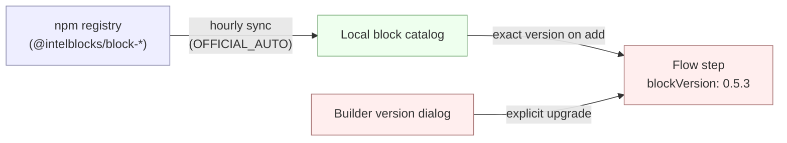

Blocks are standard [npm packages](https://www.npmjs.com/search?q=%40intelblocks%2Fblock-). Two facts follow from that:

- **No server upgrade is needed for new blocks** — a sync job pulls fresh versions on its own.
- **Each step is pinned to an exact version** — flows never auto-upgrade. Bumps are explicit, through the builder.

## Packaging

| Type | Source | Installed by |
|---|---|---|
| Official | Intellisper cloud registry | Auto-sync |
| Custom (npm) | npm registry, scoped to one platform | Platform admin |
| Private (archive) | `.tgz` upload | Platform admin |

Custom and private blocks are managed manually — see [Manage blocks](/admin-guide/guides/manage-blocks).

## Auto-sync

| `IB_BLOCKS_SYNC_MODE` | Behavior |
|---|---|
| `NONE` | No registry sync. Blocks come from the local DB only — a fresh instance makes no outbound block-registry call. **Default for this edition.** |
| `OFFICIAL_AUTO` | Hourly reconcile against the registry at `IB_BLOCKS_REGISTRY_URL`. This edition ships **no** hardcoded registry host, so this mode requires `IB_BLOCKS_REGISTRY_URL` to be set; if it's empty, sync is skipped. |
| `NPM` | Resolve blocks from the public NPM registry / bundled blocks. |

Custom and private blocks are never touched by the sync job.

## Server compatibility

Every block declares a `minimumSupportedRelease` (and optional `maximumSupportedRelease`) in its definition — the range of Intellisper server releases it works on. The catalog filters blocks against the running server's release, so an out-of-range block is never listed in the builder and never served from the registry.

<Warning>
**Self-hosted: upgrade to `0.82.0` or newer.** Every new block now declares `minimumSupportedRelease ≥ 0.82.0`, the floor that came in with the latest block-context version. Servers below `0.82.0` will not pick up any newly published blocks or bug fixes. Cloud is always on the latest release.
</Warning>

## Version pinning

Adding a step records the exact block version at that moment (e.g. `0.5.3`). The pin stays until a human changes it. To upgrade, open the step in the builder, click the version next to its name, and pick a new one. The dialog warns when the change crosses a minor or major boundary.

## Related

- [Manage blocks](/admin-guide/guides/manage-blocks) — install, hide, upload custom blocks.
- [Block versioning](/build-blocks/block-reference/block-versioning) — semver rules for block authors.
